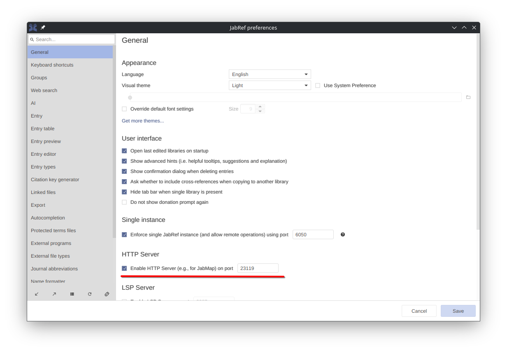
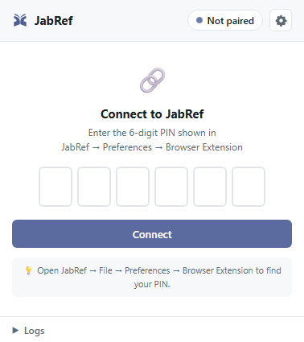
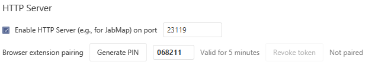
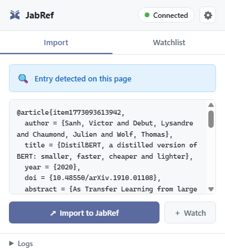
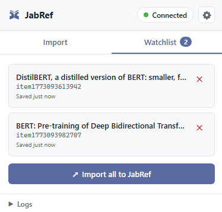
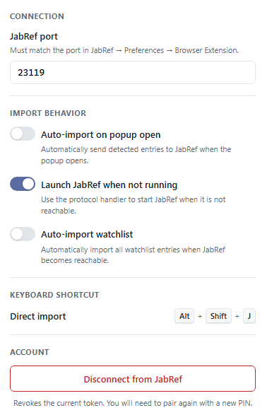

# JabRef Browser Extension

> [Firefox](https://addons.mozilla.org/en-US/firefox/addon/jabref/?src=external-github) -  [Chrome](https://chrome.google.com/webstore/detail/jabref-browser-extension/bifehkofibaamoeaopjglfkddgkijdlh) - [Edge](https://microsoftedge.microsoft.com/addons/detail/pgkajmkfgbehiomipedjhoddkejohfna) - [Vivaldi](https://chrome.google.com/webstore/detail/jabref-browser-extension/bifehkofibaamoeaopjglfkddgkijdlh)

Browser extension for users of the bibliographic reference manager [JabRef](https://www.jabref.org/).
It automatically identifies and extracts bibliographic information on websites and sends them to JabRef with one click.

When you find an interesting article through Google Scholar, the arXiv or journal websites, this browser extension allows you to add those references to JabRef.
Even links to accompanying PDFs are sent to JabRef, where those documents can easily be downloaded, renamed and placed in the correct folder.
[A wide range of publisher sites, library catalogs and databases are supported](https://www.zotero.org/support/translators).

_Please post any issues or suggestions [here on GitHub](https://github.com/JabRef/JabRef-Browser-Extension/issues)._

## Key Features

- **Automatic detection**: detects embedded BibTeX or RIS blocks on the current page using Zotero translators.
- **Authenticated HTTP communication**: sends entries to JabRef over HTTP with token-based authentication (PIN pairing).
- **Protocol handler fallback**: launches JabRef via `jabref://` when it is not running, then retries the import automatically.
- **Watchlist**: save entries locally for later import, synced across browsers via `browser.storage.sync`.
- **Direct-import keyboard shortcut**: press <kbd>Alt</kbd>+<kbd>Shift</kbd>+<kbd>J</kbd> to import the current page directly into JabRef.
- **Modern UI**: clean, modern popup with import/watchlist tabs, inline settings, and pairing flow.

## Installation

### 1. Install JabRef

Download JabRef from <https://www.jabref.org/> and install it normally.
Use the **installer** (not the portable version) so that the `jabref://` protocol handler is registered automatically.

> **Note:** The authenticated communication and protocol handler require JabRef 6.0 or later.

### 2. Enable the HTTP server in JabRef

Open JabRef and go to **File → Preferences → Network**.
Enable the HTTP server and note the port (default `23119`).



### 3. Install the browser extension

Install the extension from your browser's store:

> [Firefox](https://addons.mozilla.org/en-US/firefox/addon/jabref/?src=external-github) -  [Chrome](https://chrome.google.com/webstore/detail/jabref-browser-extension/bifehkofibaamoeaopjglfkddgkijdlh) - [Edge](https://microsoftedge.microsoft.com/addons/detail/pgkajmkfgbehiomipedjhoddkejohfna) - [Vivaldi](https://chrome.google.com/webstore/detail/jabref-browser-extension/bifehkofibaamoeaopjglfkddgkijdlh)

### 4. Pair the extension with JabRef

The first time you use the extension and try to import an entry, it needs to pair with your JabRef instance.
This is a one-time setup that establishes a secure connection.

1. Make sure JabRef is running.
2. Navigate to a page with bibliographic data (e.g., [arXiv](https://arxiv.org/abs/1910.01108), Google Scholar, publisher sites).
3. Click the JabRef extension icon in your browser toolbar and click on "Import to JabRef".
4. The popup detects that it is not paired and shows a **PIN input**.



1. Open JabRef and go to **File → Preferences → Network**.
2. Generate a new **6-digit PIN** which is valid for 5 minutes. Enter it in the extension.



1. The extension verifies the PIN and shows **Connected**. You are ready to go.

The pairing is persistent - you only need to do this once per browser.
If you reinstall JabRef or clear the extension data, repeat the pairing.

## Usage

### Import from popup

1. Navigate to a page with bibliographic data (e.g., [arXiv](https://arxiv.org/abs/1910.01108), Google Scholar, publisher sites).
2. Click the extension icon. The popup detects metadata automatically.
3. Click **Import to JabRef**. The entry appears in your currently active JabRef library.



If JabRef is not running, the extension launches it via the `jabref://` protocol handler, waits for it to start, and retries the import automatically.

### Direct import via keyboard shortcut

Press <kbd>Alt</kbd>+<kbd>Shift</kbd>+<kbd>J</kbd> on any supported page to import directly into JabRef without opening the popup.

### Watchlist

Click **+ Watch** to save an entry for later import.
Watchlist entries are synced across browsers by your browser account.
Switch to the **Watchlist** tab to review, import, or remove saved entries.



### Settings

Click the **gear icon** in the popup header to access settings:

- **Port** - must match JabRef's HTTP server port (default `23119`)
- **Auto-import on popup open** - Automatically send detected entries to JabRef when the popup opens
- **Launch JabRef when not running** - trigger the protocol handler when JabRef is not running
- **Auto-import watchlist** - automatically import all watchlist entries when JabRef becomes reachable
- **Disconnect** - revoke the current pairing token



### Troubleshooting

- **"JabRef not reachable"** - Make sure JabRef is running and the HTTP server is enabled in preferences. Check that the port matches.
- **"Pairing required"** - Click the pairing panel and enter the PIN shown in JabRef (Preferences → General → HTTP Server).
- **Protocol handler not working** - Make sure you installed JabRef using the installer, not the portable version. On first use, your browser will ask permission to open `jabref://` links.
- **Keyboard shortcut not working** - Go to `chrome://extensions/shortcuts` (Chrome) or `about:addons` → gear icon → Manage Extension Shortcuts (Firefox) and verify the shortcut is assigned.
- Open the popup DevTools (right-click the popup → Inspect) to view detailed logs.

### Developer mode install

It is possible to install the most recent developer version instead of the one from the store:
You can load it as an unpacked/temporary extension.

#### Chromium-based browsers (Chrome, Edge, Brave)

1. Open `chrome://extensions/` in the browser.
2. Enable **Developer mode** (toggle top-right).
3. Click **Load unpacked** and select this repository folder (the folder that contains `manifest.json`).

#### Firefox

1. Open `about:debugging#/runtime/this-firefox`.
2. Click **Load Temporary Add-on...** and select the `manifest.json` file from this repository.

#### Safari (macOS and Xcode required)

1. Run `make safari` to build the Safari extension.
2. Open the generated Xcode project in `dist/safari/JabRef Browser Extension/`.
3. Click the **Play** button (or press `Cmd+R`) in Xcode to build and run the extension.
4. Safari will open. You may need to enable the extension in **Safari Settings** > **Extensions**.
5. Ensure **Allow Unsigned Extensions** is enabled in the **Develop** menu (if you don't see the Develop menu, enable it in Safari Settings > Advanced).

Note: Loading the extension this way is temporary in Firefox and will be removed when the browser restarts. For permanent installation you can pack and sign the extension or install from a browser extension store.

## Usage

1. Start JabRef and ensure remote operation is enabled.
2. Open the extension popup from the toolbar.
3. The popup attempts automatic detection on the active tab; if it finds or converts a BibTeX entry it will populate the textbox.
   For example, [the arXiv](http://arxiv.org/list/gr-qc/pastweek?skip=0&show=5) and click the JabRef symbol in the Firefox search bar (or press <kbd>Alt</kbd>+<kbd>Shift</kbd>+<kbd>J</kbd>).
4. Once the JabRef browser extension has extracted the references you can import it into JabRef or save it to your watchlist.

Notes:

- If the popup cannot connect to JabRef, check the configured port in the extension settings and that JabRef is running and listening for HTTP requests.
- Ensure the extension is succesfully paired with JabRef.
- Open the popup DevTools (right-click → Inspect) to view logs when debugging translators or connection issues.

## About this Add-On

Internally, this browser extension uses the magic of Zotero's site translators.
As a consequence, most of the credit has to go to the Zotero development team and to the many authors of the [site translators collection](https://github.com/zotero/translators).
Note that this browser extension does not make any changes to the Zotero database and thus both plug-ins coexist happily with each other.

## Contributing to the Development

### Prerequisites

1. Install [Node.js](https://nodejs.org) (e.g., `choco install nodejs`)
2. [Fork the repository](https://help.github.com/articles/fork-a-repo/).
3. Clone the repository **with submodules**: `git clone --recursive git@github.com:{your-username}/JabRef-Browser-Extension.git`
4. Install development dependencies via `npm install`.
5. **After cloning the repo execute the python script `scripts/import_and_patch_translators.py`**
6. JabRef running locally and reachable over HTTP on a configurable port.
7. The popup assumes JabRef is reachable at `http://localhost:<port>` (default port stored in extension settings, default `23119`).
8. Start browser with the add-on activated:
   Firefox: `npm run dev:firefox`
   Chrome: `npm run dev:opera`
   Safari: `make safari` (then run the generated Xcode project; **macOS and Xcode required**)

### Install (Developer)

1. Open your Chromium-based browser and go to `chrome://extensions/`.
2. Enable **Developer mode**.
3. Click **Load unpacked** and select this repository folder.

For Firefox development use `about:debugging#/runtime/this-firefox` and load a temporary add-on.

For Safari development, run `make safari` and open the resulting Xcode project in `dist/safari/` (**macOS and Xcode required**).

#### Local Signing and Notarization (Safari)

If you have a Developer ID certificate and want to sign and notarize the Safari extension locally:

1. Build the extension: `make safari`
2. Sign the app: `make sign-safari-local IDENTITY="Developer ID Application: Your Name (ID)"`
3. Notarize the app:
   - First, create a notarytool profile: `xcrun notarytool store-credentials "profile-name" --apple-id "your@apple.id" --team-id "TEAMID" --password "app-specific-password"`
   - Then run: `make notarize-safari-local PROFILE="profile-name"`

The final notarized and zipped extension will be at `dist/safari/jabref-browser-extension-safari.zip`.

### Project Structure (high level)

```text
JabRef Browser Extension/
├── popup.html / .css / .js   # Popup UI with state machine, import/watchlist/pairing
├── background.js             # Service worker: translator execution, direct-import shortcut
├── offscreen.html / .js      # Offscreen context for Chrome translator execution
├── settings.html / .js       # Browser options page (mirrors popup settings overlay)
├── sources/
│   ├── jabref-api.js         # HTTP client: health check, send BibTeX, pairing, poll
│   ├── watchlist.js          # Watchlist CRUD (chrome.storage.sync)
│   ├── translatorRunner.js   # Zotero translator execution engine
│   ├── zoteroShims.js        # Zotero API compatibility layer
│   └── vendor/linkedom.js    # DOM parser for background context
├── translators/              # Bundled Zotero translators + manifest.json
└── manifest.json             # MV3 manifest with commands section
```

### Testing

The extension includes a simple testing system, leveraging the test cases in the translators. To run tests:

```bash
npm install
node test.js <translator-file.js>
```

While it is possible to run tests without a specific translator file, providing one will limit the tests to only those defined in that file.
If a translator does not work as intended the tests can help identify issues (e.g., missing zotero shims).

### Troubleshooting

- If connection fails, open popup DevTools and inspect the console. The popup provides extended HTTP error logging.
- Some legacy translators may need extra small shims; errors will be logged to the popup console and persisted to storage.
- If translators fail to run due to Manifest V3 CSP, the code attempts to run legacy translators in the offscreen runner to avoid unsafe-eval.

### Update dependencies

- `npm outdated` gives an overview of outdated packages ([doc](https://docs.npmjs.com/cli/outdated))
- `npm-upgrade` updates all packages
- `npm install` install updated packages

### Release of new version

- Increase version number in `manifest.json`
- `npm run build`
- Upload to:
  - <https://addons.mozilla.org/en-US/developers/addon/jabref/versions/submit/>
  - <https://chrome.google.com/u/2/webstore/devconsole/26c4c347-9aa1-48d8-8a22-1c79fd3a597e/bifehkofibaamoeaopjglfkddgkijdlh/edit/package>
  - <https://addons.opera.com/developer/upload/>
  - <https://developer.apple.com/app-store-connect/>
- Remove the `key` field in `manifest.json` and build again. Then upload to:
  - <https://partner.microsoft.com/en-us/dashboard/microsoftedge/2045cdc1-808f-43c4-8091-43e2dcaff53d/packages>
